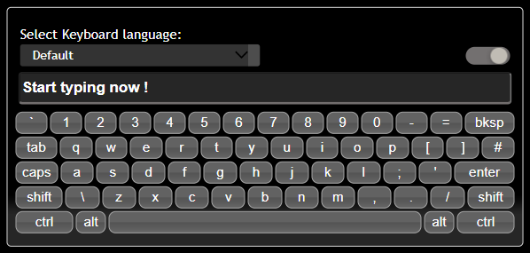
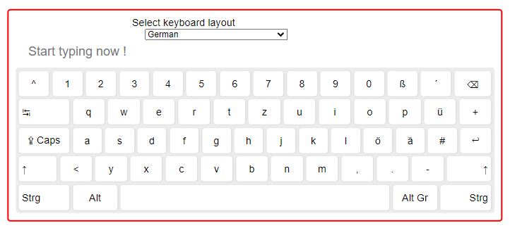
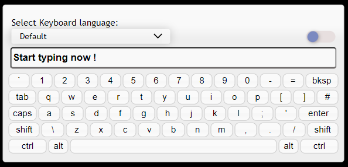

# Vue Keyboard Component
A virtual keyboard component built with VUE 3 and VITE.

Inspired from simple-keyboard by [Francisco Hedge](https://hodgef.com/simple-keyboard/) and
from Keyboard by [Rob Garrison](https://mottie.github.io/Keyboard/docs/layouts.html).

### Dark mode example.


### German keyboard layout example, with custom buttons.


### Light mode example.


### ✏ Features:

- Fully responsive.
- Supports dark and light theme out of the box. Using the user's preferred color scheme.
- Theme can be set with the built-in theme switcher.
- 150 microsoft keyboard layouts included in the package.

### ✏ Upcoming Features:

- Add support for physical keyboard.
- Add possibility to style one or more buttons different from the rest.
- Refactor keyboard button to accept multiple layout values and display them in the button.


### 📔 TODO's:

- Fix function button issues.
- Check missing microsoft layouts.
- Create new documentation.


### 📚 Documentation

- Add your own layout by [following these steps](./docs/sample-layout.md).
- Add your own display layout to customise the keyboard by [following these steps](./docs/sample-keyboard.md).

### 🏁 Demo's

- TBD

### ⌨ Supported Layouts (150 different layouts)

* [Click to see the complete list.](./docs/keyboard-layouts.md)
* [Microsoft layout's.](https://learn.microsoft.com/en-us/globalization/windows-keyboard-layouts)

### 🔗 References

- [List of QWERTY keyboard language variants](https://en.wikipedia.org/wiki/List_of_QWERTY_keyboard_language_variants)
- [README Icon's List](https://github.com/ikatyang/emoji-cheat-sheet/blob/master/README.md)
- [Symbols Ascii code list](https://www.alt-codes.net/)

### 🌟 Contributing

Contributions are always welcome!

[Create a new issue or report a bug.](https://github.com/gwinnem/vue-virtual-keyboard/issues)


## 💲 Donate
<a href="https://paypal.me/gwinnem/">
    
</a>

If you enjoyed this project — or just feeling generous, consider buying me a beer. Cheers! :beers:

---

### 📦 Installation & Usage

```
npm install
```

#### Compiles and hot-reloads for development

```
npm run dev
```

#### Compiles and minifies for production

```
npm run build
```

#### Lints code files

```
npm run lint
```

#### Lints style files

```
npm run lint:style
```

#### Fixes linting errors

```
npm run lint:fix
```

#### Formats files.

```
npm run lint
```

#### Building the library

```
npm run build
```

### Publishing the library

In order to publish the package, you need to follow these steps

#### Bumping the package version

```
npm version patch -m "message"
```

#### Adding a git tag

```
git tag
```

#### Pushing to git with tags

```
 git push --follow-tags
```

#### Publishing the package to the registry

```
 npm publish
```
