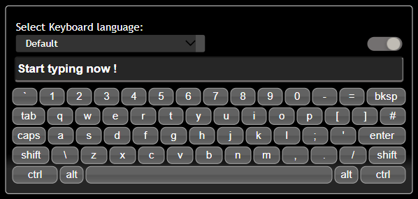
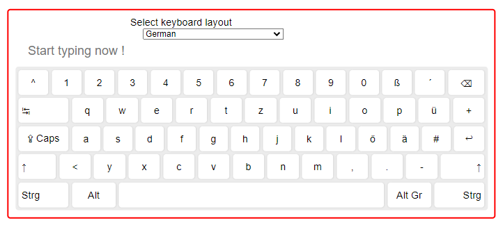
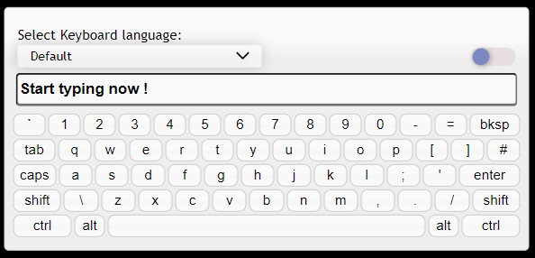

# Vue Keyboard Component

[](https://github.com/gwinnem/vue-virtual-keyboard/actions/workflows/ci.yml)
[](https://www.npmjs.com/package/vue-virtual-keyboard)
[](https://opensource.org/licenses/MIT)

A virtual keyboard component built with VUE 3 and VITE. Requires Node.js >= 20.17 to build/develop this repo (see [engines](./package.json)); the published package itself has no Node runtime requirement.

Inspired from <strong>simple-keyboard</strong> by [Francisco Hedge](https://hodgef.com/simple-keyboard/) and
from <strong>Keyboard(jQuery plugin)</strong> by [Rob Garrison](https://mottie.github.io/Keyboard/docs/layouts.html).

### Dark mode example.


### German keyboard layout example, with custom buttons.


### Light mode example.


### ✏ Features:

- Fully responsive.
- Supports unicode values in the layout. Both images and special characters.
- Supports dark and light theme out of the box. Using the user's preferred color scheme.
- Theme can be set with the built-in theme switcher. It uses local storage to remember the selected theme.
- 150 Microsoft keyboard layouts included in the package, lazily loaded on demand - selecting a layout downloads only that layout's data, keeping the base bundle small.
- Written in TypeScript, with type definitions shipped in the package.
- ARIA labels, `aria-pressed` toggle states, and a labeled group/switch structure for screen reader support.
- Automatic right-to-left rendering for RTL layouts (Arabic, Hebrew, Persian, Urdu, and others), and localizable accessible key names via `keyboardTranslation`.
- Roving-tabindex grid navigation - only one key is a Tab stop at a time, with arrow keys moving between keys, so keyboard-only users aren't stuck pressing Tab dozens of times.
- Tested with Vitest + Vue Test Utils (unit/component) and Playwright (end-to-end, including touch-emulated interaction).

### ✏ Upcoming Features:

- Add possibility to style one or more buttons different from the rest.
- Refactor keyboard button to accept multiple layout values and display them in the button.


### 📔 TODO's:

- [ ] Fix function button issues.
- [ ] Fix issue with button rendering the space button. It gets the wrong css class so the styling is incorrect.
- [ ] Check missing microsoft layouts.


### 📚 Documentation

- [Full documentation site](https://vue-virtual-keyboard.winnem.tech) (installation, guides, API reference).
- Add your own layout by [following these steps](./docs/sample-layout.md).
- [Exported Interfaces](./docs/exported-interfaces.md).
- [Select options. Complete list](./docs/complete-select-option-list.md).
- [Changelog](./vitepress-docs/guide/changelog.md) - **v2.0.0 contains breaking changes** to CSS class names and custom property names; read this before upgrading.

### 🚀 Quick start

```bash
npm install vue-virtual-keyboard
```

```vue
<script setup lang="ts">
import { ref } from 'vue';
import { Keyboard, defaultLayout } from 'vue-virtual-keyboard';
import type { ILayoutItem } from 'vue-virtual-keyboard';
import 'vue-virtual-keyboard/style.css';

const layout = ref<ILayoutItem>(defaultLayout.default);
</script>

<template>
  <Keyboard :keyboard-layout="layout" />
</template>
```

See the [installation guide](./vitepress-docs/guide/installation.md) for Options API usage and more detail.

### 👓 Customizing dark and light mode
[List of css variables](./docs/theme-variables.md).

### 🏁 Demo

This repo includes one sandbox app (`sandbox/App.vue`) with the layout selector and theme
switcher both enabled. Run it locally with:

```
npm install
npm run dev
```

### ⌨ Supported Layouts (150 different layouts)

* [Click to see the complete list](./docs/keyboard-layouts.md).
* [Microsoft layout's](https://learn.microsoft.com/en-us/globalization/windows-keyboard-layouts).


### 🔗 References

- [List of QWERTY keyboard language variants](https://en.wikipedia.org/wiki/List_of_QWERTY_keyboard_language_variants)
- [README Icon's List](https://github.com/ikatyang/emoji-cheat-sheet/blob/master/README.md)
- [Symbols Ascii code list](https://www.alt-codes.net/)
- [Keyboard example](https://codepen.io/ethanbustad/pen/neNgvp)
- [Keyboard example](https://codepen.io/32bitkid/pen/LKZzMR)
- [Keyboard example](https://codepen.io/kulpreets/pen/MKgqqB)
- [Vue Search Select](https://github.com/moreta/vue-search-select)

### 📓 Project info

- [Changelog](./CHANGELOG.md)
- [Architecture](./ARCHITECTURE.md)
- [Contributing](./CONTRIBUTING.md)
- [Code of Conduct](./CODE_OF_CONDUCT.md)
- [Governance](./GOVERNANCE.md)
- [Security policy](./SECURITY.md)
- [Support](./SUPPORT.md)
- [License](./LICENSE) (MIT) and [trademark/data notice](./NOTICE.md)

### 🌟 Contributing

#### Contributions are always welcome!

***
Help is needed defining which images or text to use for the different keyboard layouts.
Look at the German display definition below:

```
  display: {
    // eslint-disable sort-keys
    '{alt}': `Alt`,
    '{altleft}': `Alt`,
    '{altright}': `Alt Gr`,
    '{bksp}': `\u232b`,
    '{caps}': `\u21ea`,
    '{ctrl}': `Strg`,
    '{ctrlleft}': `Strg`,
    '{ctrlright}': `Strg`,
    '{empty}': ` `,
    '{enter}': `\u21A9`,
    '{lock}': `caps \u21ea`,
    '{shift}': `\u2191`,
    '{shiftleft}': `\u2191`,
    '{shiftright}': `\u2191`,
    '{space}': ` `,
    '{tab}': `\u2b7e`,
  },
```


## 📓 Bug and Issue creation
[Create a new issue or report a bug.](https://github.com/gwinnem/vue-virtual-keyboard/issues)


## 💲 Donate
<a href="https://paypal.me/gwinnem/">
    
</a>

If you enjoyed this project — or just feeling generous, consider buying me a beer. Cheers! :beers:

---

### 📦 Contributing to this repo

This section is for people working on this repo itself, not for consumers of the published package (see "Quick start" earlier in this README for that).

```
npm install
```

#### Compiles and hot-reloads for development

```
npm run dev
```

#### Compiles and minifies for production

```
npm run build:only
```

#### Building type declarations

```
npm run build:types
```

#### Runs unit/component tests (Vitest + Vue Test Utils)

```
npm run test
```

#### Runs unit/component tests in interactive watch mode

```
npm run test:watch
```

#### Runs unit/component tests in the Vitest UI (browser-based test runner/explorer)

```
npm run test:ui
```

#### Runs unit/component tests with a coverage report

```
npm run test:coverage
```

#### Runs end-to-end tests (Playwright)

```
npm run e2e:install
npm run e2e:run
```

#### Typechecks the project

```
npm run typecheck
```

#### Lints code files

```
npm run lint
```

#### Lints style files

```
npm run lint:style
```

#### Fixes linting errors

```
npm run lint:fix
```

### Publishing the library

Publishing is automated: pushing a `v*.*.*` tag triggers
[`.github/workflows/publish.yml`](./.github/workflows/publish.yml), which runs the full check
suite, verifies the tag matches `package.json`'s version, and publishes with
[npm provenance](https://docs.npmjs.com/generating-provenance-statements) (attesting the published
package was built from this exact commit in this exact CI run - verifiable via
`npm audit signatures`). This requires an `NPM_TOKEN` repository secret with publish access,
configured separately in repo settings.

```bash
npm version patch -m "message"   # bumps package.json and creates a git tag
git push --follow-tags           # pushes the tag, which triggers the publish workflow
```

You can still publish manually (`npm publish`) if needed, but you'll lose the provenance
attestation unless you also pass `--provenance` and have `id-token: write` OIDC context, which
isn't available outside of a supporting CI environment.
