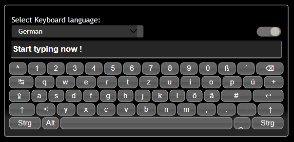

# Vue Keyboard Component
A virtual keyboard component built with VUE 3 and VITE.

Inspired from <strong>simple-keyboard</strong> by [Francisco Hedge](https://hodgef.com/simple-keyboard/) and
from <strong>Keyboard(jQuery plugin)</strong> by [Rob Garrison](https://mottie.github.io/Keyboard/docs/layouts.html).

### Dark mode example.


### German keyboard layout example, with custom buttons.


### Light mode example.


### ✏ Features:

- Fully responsive.
- Supports unicode values in the layout. Both images and special characters.
- Supports dark and light theme out of the box. Using the user's preferred color scheme.
- Theme can be set with the built-in theme switcher. It uses local storage to remember the selected theme.
- 150 microsoft keyboard layouts included in the package.

### ✏ Upcoming Features:

- Add support for physical keyboard.
- Support for filtering layouts with includedLayouts prop.
- Support for providing default display option as prop.
- Add possibility to style one or more buttons different from the rest.
- Refactor keyboard button to accept multiple layout values and display them in the button.


### 📔 TODO's:

- [ ] Fix function button issues.
- [ ] Fix issue with button rendering the space button. It gets the wrong css class so the styling is incorrect.
- [ ] Check missing microsoft layouts.
- [ ] Create new documentation (WIP).


### 📚 Documentation

- Add your own layout by [following these steps](./docs/sample-layout.md).
- [Exported Interfaces](./docs/exported-interfaces.md).
- [Select options. Complete list](./docs/complete-select-option-list.md).

### 👓 Customizing dark and light mode
[List of css variables](./docs/theme-variables.md).

### 🏁 Demo's

- Default with theme and layout selector.
- Styled buttons.
- Demo with customized layout from app.
- Playground where devs can test their layouts(sandbox).

### ⌨ Supported Layouts (150 different layouts)

* [Click to see the complete list](./docs/keyboard-layouts.md).
* [Microsoft layout's](https://learn.microsoft.com/en-us/globalization/windows-keyboard-layouts).


### 🔗 References

- [List of QWERTY keyboard language variants](https://en.wikipedia.org/wiki/List_of_QWERTY_keyboard_language_variants)
- [README Icon's List](https://github.com/ikatyang/emoji-cheat-sheet/blob/master/README.md)
- [Symbols Ascii code list](https://www.alt-codes.net/)
- [Keyboard example](https://codepen.io/ethanbustad/pen/neNgvp)
- [Keyboard example](https://codepen.io/32bitkid/pen/LKZzMR)
- [Keyboard example](https://codepen.io/kulpreets/pen/MKgqqB)

### 🌟 Contributing

#### Contributions are always welcome!

***
Help is needed defining which images or text to use for the different keyboard layouts.
Look at the German display definition below:

```
  display: {
    // eslint-disable sort-keys
    '{alt}': `Alt`,
    '{altleft}': `Alt`,
    '{altright}': `Alt Gr`,
    '{bksp}': `\u232b`,
    '{caps}': `\u21ea`,
    '{ctrl}': `Strg`,
    '{ctrlleft}': `Strg`,
    '{ctrlright}': `Strg`,
    '{empty}': ` `,
    '{enter}': `\u21A9`,
    '{lock}': `caps \u21ea`,
    '{shift}': `\u2191`,
    '{shiftleft}': `\u2191`,
    '{shiftright}': `\u2191`,
    '{space}': ` `,
    '{tab}': `\u2b7e`,
  },
```
***
[Create a new issue or report a bug.](https://github.com/gwinnem/vue-virtual-keyboard/issues)


## 💲 Donate
<a href="https://paypal.me/gwinnem/">
    
</a>

If you enjoyed this project — or just feeling generous, consider buying me a beer. Cheers! :beers:

---

### 📦 Installation & Usage

```
npm install
```

#### Compiles and hot-reloads for development

```
npm run dev
```

#### Compiles and minifies for production

```
npm run build
```

#### Lints code files

```
npm run lint
```

#### Lints style files

```
npm run lint:style
```

#### Fixes linting errors

```
npm run lint:fix
```

#### Building the library

```
npm run build
```

### Publishing the library

In order to publish the package, you need to follow these steps

#### Bumping the package version

```
npm version patch -m "message"
```

#### Adding a git tag

```
git tag
```

#### Pushing to git with tags

```
 git push --follow-tags
```

#### Publishing the package to the registry

```
 npm publish
```
